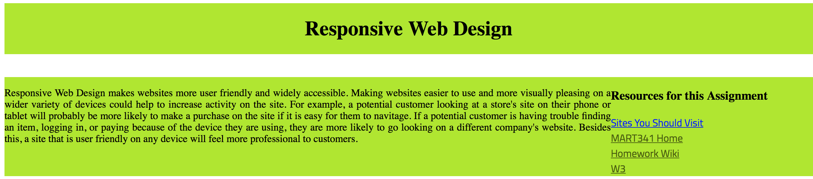
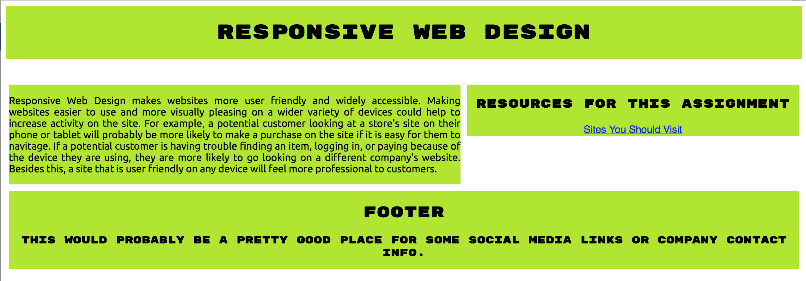

# Week 10
### Responsive Web Design
<ul>
  <li>Firstly, the information I wanted to convey in this site is how a well-developed and designed site can impact who is visiting the site and how, for example, a business might be affected by how well-designed or poorly designed their website is.  The title and image in the page are meant to be the first things to catch the reader's eye in order to draw them in.
  <li>Layout Plan:
  
  <li>As usual, this was tons of trial and error.  Positioning the boxes on the page was incredibly frustrating at first. Once I got that part worked out, the problem became creating space between them.  As always, my problems were easily fixed but time consuming.
  <li>Things started really messy and unorganized, but got slightly better as I went along.  One thing I was really pleased with was my dropdown menu, which made a lot more sense the second time around than it did the first.  I used the same code I did in Week 9's assignment to create it and then went back and changed it to fit this assignment and also went over the steps I took to get there.
  
  
  <li>I had a lot of trouble with the image I originally put in the layout, as getting it to sit where I wanted it on the page was extremely difficult.
  
  <li>Below are screenshots from when I tested my site with the responsive development feature on the browser I was using (Safari).
  
  
