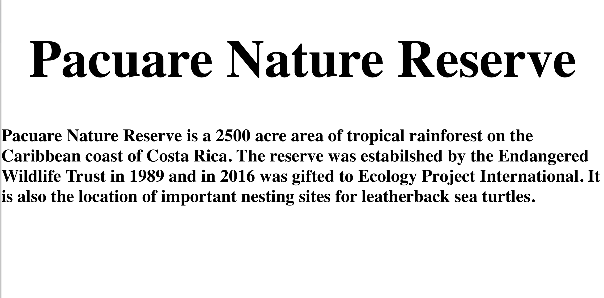
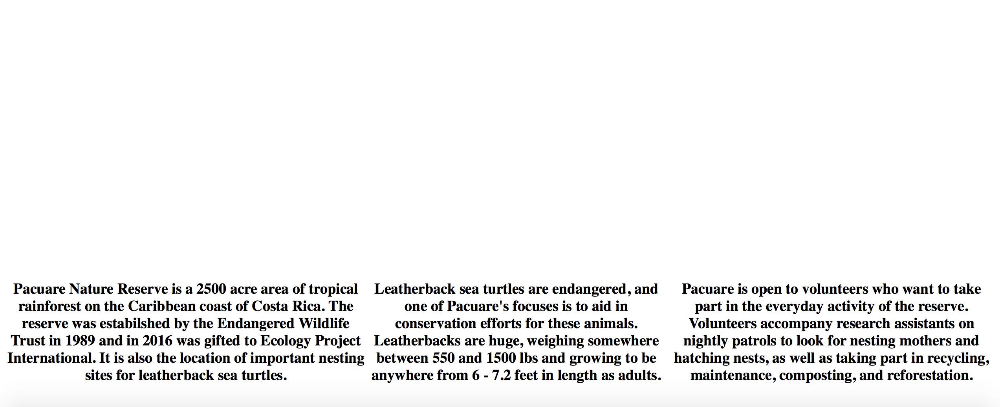

# Week 11
### Parallax
This was a disaster.  Creating the site itself was not a problem but once
I started to try and figure out the actually parallex scrolling it was a mess.
I kept trying different things to try and get the pictures to show up but what
I got was this.

Things got so convoluted and messy at one point that I decided to go back and restart my CSS file just so that I coudl make sure I only had what I needed in it.  While going through the code examples in the lesson and trying to add in what I needed, I ended up with an extremely messy css file.  Once I did that, I started to get somewhere but my image would not show up at all.

Even after I got the blocks of text separated out into different containers, no image would show up.  I tried this with multiple different image files and none of them would work.
What finally helped was a <a href = "https://www.youtube.com/watch?v=on7p8oqfv80">video walkthrough</a href> with step by step instructions on how to create a parallax site.

