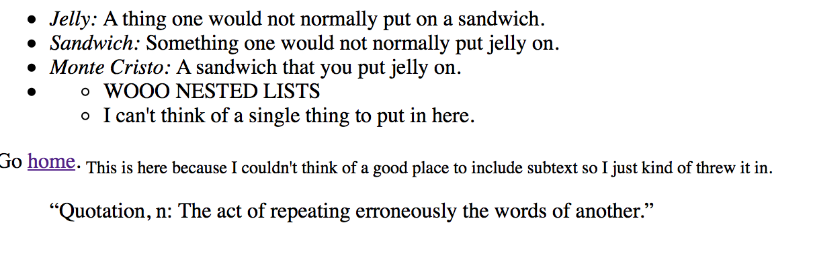
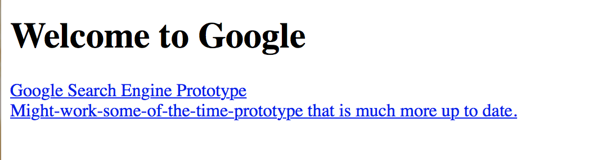
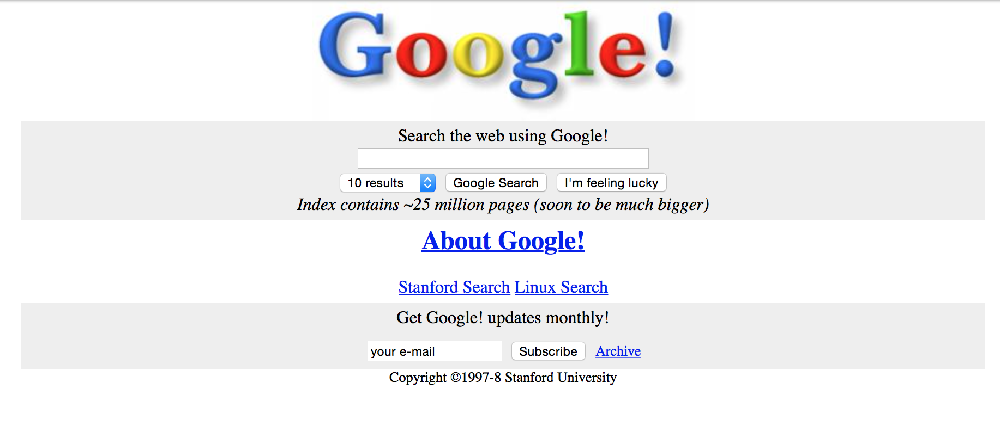
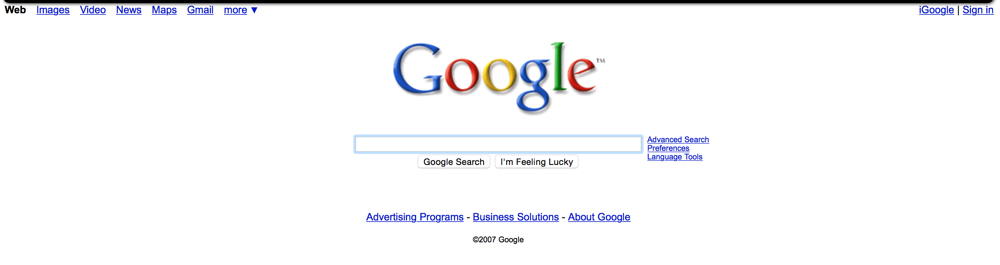
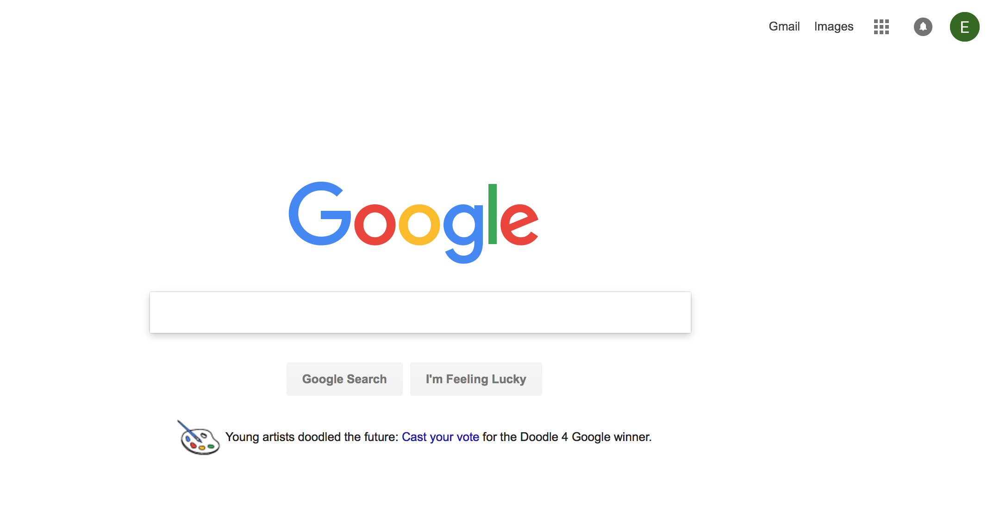
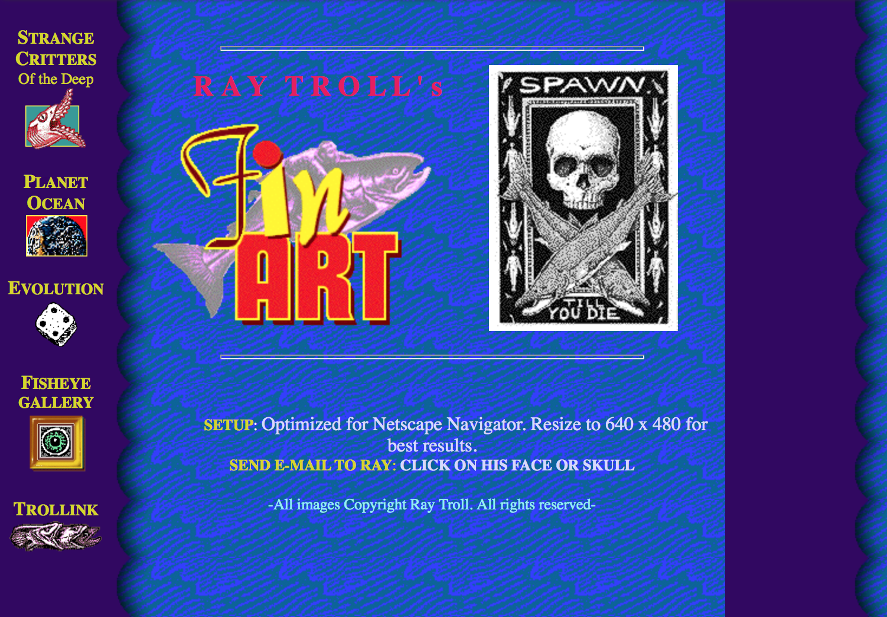

# Emily Griffin 50
## Week 4
### Progress
This week, I had very few issues with the actual content of the lesson.
The biggest/only issue I really had was just keeping track of what exactly
I needed to fit into my pages and how exactly to incorporate these pieces.
For that reason, there are a lot of strange, thrown in things in my site, such as:

Although later on I ended up using it here:

It was really interesting to go through and see the site grow every step of the way.  Luckily, as I said before, I encountered very few problems and those that I did have were solved with a little bit of messing around, as usual.

I was more worried than I needed to be about nested lists. By the sound of it, I assumed it would be complicated, but I was pleasantly surprised to find that it was very simple and that I had no problems with it whatsoever.

To make sure that I had a block quote, I chose a random quote about quotations, since I wasn't really sure how I could find a quote that was relevant to a recipe for sandwiches.

### The Wayback Machine

This is *super* interesting. I spent a good hour or so just messing around on different sites that had been marked on this website. I had no idea that there was a way to go back to earlier versions of these sites.

#### Google
Of course, I chose the obvious one. I wanted to check out Wikipedia, but it has no presence on the Wayback prior to 2001. However, taking a trip back in time through this search engine was very interesting. The earliest Google snapshot I found was from November 11th, 1998.

This looks much different than the Google site we know today, or even Google as it was 10 years ago.

Comparing these to Google today shows just how far we've come in web devlopment.

Since Google is a pretty straightforward site design-wise, there's not a ton of changes to the outward appearance of the site.  In fact, it would appear that Google has actually become simpler over the years, with less clutter and fewer buttons on today's home page than on the original.

#### Ray Troll
Although Ray Troll is not necessarily a *digital* artist, I felt that he would be a good artist to use for this particular assignment, especially since his website is archived all the way back through 1997. This snapshot from April 12th, 1997 shows the drastic different between his site then...

and his site now.

As can be seen here, Troll's site has undergone some artistic simplification, much like in Google.  While the oldest snapshot of his site shows lots of links to different parts of the site, now the homepage has only one option: "Enter".  While exploring the other snapshots of his website over time, I found that it became more cluttered over the years, with many more images on the homepage. Unfortunately, some of the images will not display now, but it's easy to see how things got very cluttered on the site before simplifying in 2011. At that point, the site adopted the straightforward approach that it shows today, and it has changed relatively little since then.
