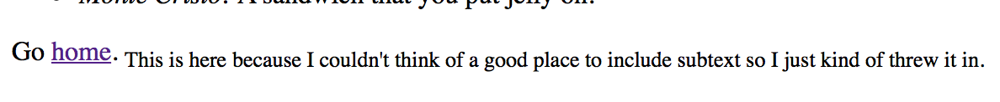
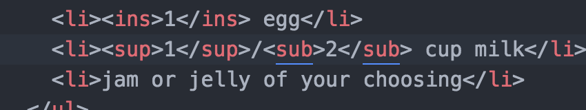
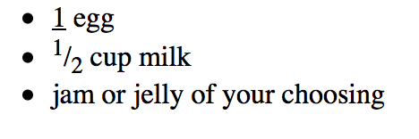

# Emily Griffin 50
## Week 4
### Progress
This week, I had very few issues with the actual content of the lesson.
The biggest/only issue I really had was just keeping track of what exactly
I needed to fit into my pages and how exactly to incorporate these pieces.
For that reason, there are a lot of strange, thrown in things in my site, such as:

Although later on I ended up using it here:

