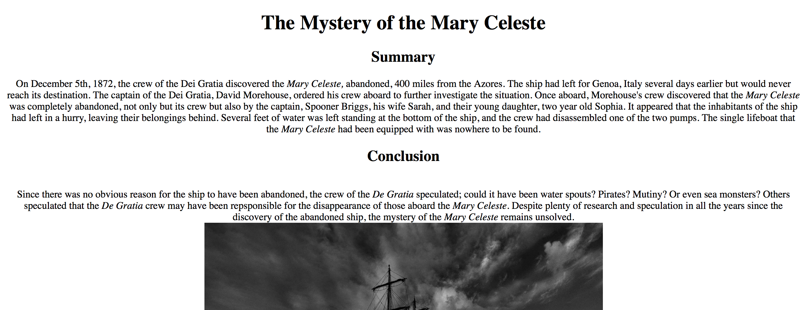
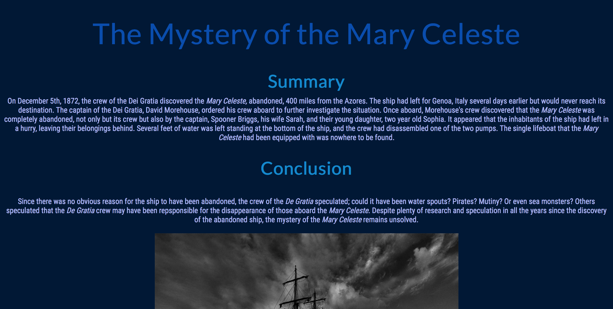
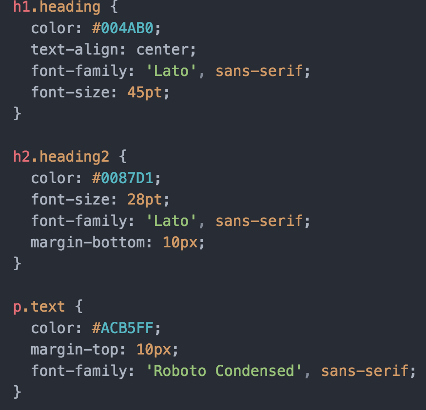

# Week 8
## CSS
Once I got the concepts down for this week, I had relatively few problems getting through it.  I think that the idea of moving into something new and different was really the hardest part about this week's assignment. Once I understood how to link fonts into the css and index files, things got a lot easier.  I was kind of worried about that particular part because I have had a few issues in the past with linking files together.

To begin with, my page looked like this:

Once I inserted colors and fonts into the css file, it looked like this:

I was really surprised with how easy creating the css file was.  As long as I knew exactly what I needed to include, typing it in and linking it to certain parts of my html file was pretty simple.

I chose dark blues for the color scheme of my page because I felt that they fit with the story that was being told.  Since the <i>Mary Celeste</i> was a ship that was found under mysterious circumstances, I felt that a darker background would give a more ominous feel, while blue could convey a cold, empty feeling.

To begin with, I had centered my text within my index file.  Later, while building the css file, I removed the center tag from the index and put it in the css file instead.

Font variant was something I liked including in my page because I thought it gave a much more serious and interesting look to what I was creating.

When I came to text indentations, I ended up grouping my text differently.  Originally I'd had one class for my paragraphs, but because I wanted to indent them separately, I ended up splitting them into different classes.

