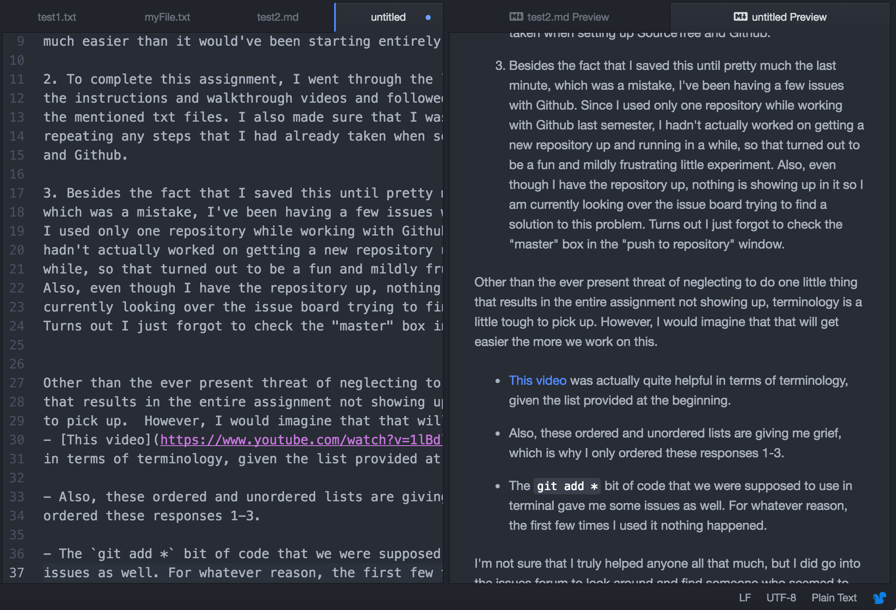

# Emily Griffin 50
## Getting Set Up

1. For this week, I set up a new repository within Github
where I can keep my work for this class. I also made a
few small text files while going through the lesson for the week.
Since I already had Atom and SourceTree downloaded from last
semester and already had a Github account set up, this was all
much easier than it would've been starting entirely from scratch.

2. To complete this assignment, I went through the lesson and followed
the instructions and walkthrough videos and followed along by creating
the mentioned txt files. I also made sure that I wasn't unnecessarily
repeating any steps that I had already taken when setting up SourceTree
and Github.

3. Besides the fact that I saved this until pretty much the last minute,
which was a mistake, I've been having a few issues with Github.  Since
I used only one repository while working with Github last semester, I
hadn't actually worked on getting a new repository up and running in a
while, so that turned out to be a fun and mildly frustrating little experiment.
Also, even though I have the repository up, nothing is showing up in it so I am
currently looking over the issue board trying to find a solution to this problem.
Turns out I just forgot to check the "master" box in the "push to repository" window.

Other than the ever present threat of neglecting to do one little thing
that results in the entire assignment not showing up, terminology is a little tough
to pick up.  However, I would imagine that that will get easier the more we work on this.
- [This video](https://www.youtube.com/watch?v=1lBdlh3AGSc) was actually quite helpful
in terms of terminology, given the list provided at the beginning.

- Also, these ordered and unordered lists are giving me grief, which is why I only
ordered these responses 1-3.

- The `git add *` bit of code that we were supposed to use in terminal gave me some
issues as well. For whatever reason, the first few times I used it nothing happened.

I'm not sure that I truly helped anyone all that much, but I did go into the issues
forum to look around and find someone who seemed to be having a problem that was
almost identical to one I had had. I suggested that she double check something,
since (as I said above) little things can cause big issues and in my case, that
was exactly what happened.

